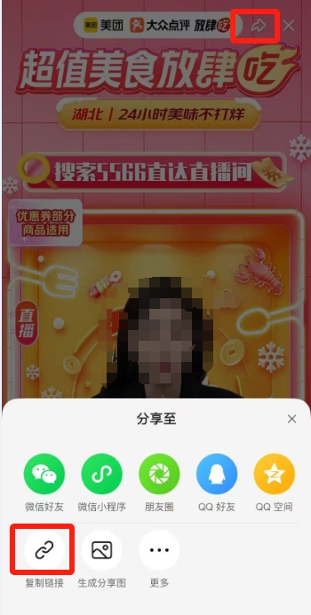

# 项目说明

- 美团爬虫

# 安装环境

- python3.10+
- `pip install wauo -U`

# 如何抓取弹幕

## 方式1

- 获取short_url



# 方式2

- 获取live_id


# 启动爬虫

`python test.py`

- 运行test.py

```python
m = MeituanSpider()

# 方式1
short_url = "http://dpurl.cn/voNM8RIz"
m.listen(short_url=short_url)

# 方式2
live_id = "8742021"
m.listen(live_id=short_url)
```